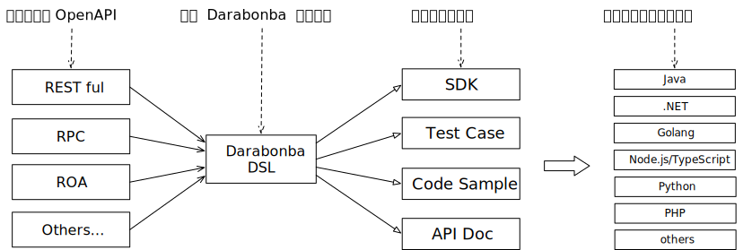

# Darabonba

[![NPM version][npm-image]][npm-url]
[](https://github.com/aliyun/darabonba/actions/workflows/node.js.yml)
[![codecov][cov-image]][cov-url]
[![npm download][download-image]][download-url]


[npm-image]: https://img.shields.io/npm/v/@darabonba/parser.svg?style=flat-square
[npm-url]: https://npmjs.org/package/@darabonba/parser
[cov-image]: https://codecov.io/gh/aliyun/darabonba/branch/master/graph/badge.svg
[cov-url]: https://codecov.io/gh/aliyun/darabonba
[download-image]: https://img.shields.io/npm/dm/@darabonba/parser.svg?style=flat-square
[download-url]: https://npmjs.org/package/@darabonba/parser

一种 OpenAPI 应用的领域特定语言。可以利用它为任意风格的接口生成多语言的 SDK、代码示例、测试用例、接口编排等。

## 概念



## 组件

- 解析器（当前模块）
- 生成器（陆续开源中）
  - [Java](https://github.com/aliyun/darabonba-java-generator)
  - [C#](https://github.com/aliyun/darabonba-csharp-generator)
  - [TypeScript](https://github.com/aliyun/darabonba-typescript-generator)
  - [PHP](https://github.com/aliyun/darabonba-php-generator)
  - [Golang](https://github.com/aliyun/darabonba-go-generator)
  - [Python](https://github.com/aliyun/darabonba-python-generator)
  - [C++](https://github.com/aliyun/darabonba-cpp-generator)
  - [Swift](https://github.com/aliyun/swift-generator)
  - Dart
  - Ruby
  - Lua
  - Kotlin
- [VS Code 插件](https://github.com/aliyun/darabonba-vscode)：提供语法高亮、代码提示、代码格式化、语法检查
- [CLI](https://github.com/aliyun/darabonba-cli)：命令行工具
- [Darabonba模块仓库](https://darabonba.api.aliyun.com/module)：模块仓库，提供 Darabonba 模块的发布和下载

## 文档

- [5 分钟上手 Darabonba](./doc/getting_started.md)
- 类型
  - [基本类型](./doc/types/basic_types.md)
  - [复合类型](./doc/types/complex_types.md)
  - [自定义类型 `Model`](./doc/types/model.md)
- [Function](./doc/function.md)
- [API](./doc/api.md)
- [模块系统](./doc/module.md)
- [控制语句](./doc/statements.md)
- [Darafile 详解](./doc/darafile.md)
- [基于 Darabonba 编写工具模块](./doc/demo_util.md)
- [基于 Darabonba 编写 SDK](./doc/demo_sdk.md)
- 基于 Darabonba 编写 CodeSample
- 语言规范

## 安装

```sh
$ npm install @darabonba/cli -g
```

该命令执行后会具有一个 `dara` 命令，关于 `dara` 命令的详情可参考 [CLI](https://github.com/aliyun/darabonba-cli)。

## 钉钉群（群号：34664551）


## 案例

- [阿里云多语言 SDK](https://github.com/aliyun/alibabacloud-sdk)
- [支付宝开放平台多语言 SDK](https://github.com/alipay/alipay-easysdk)

## 许可证

[Apache-2.0](/LICENSE)

Copyright (c) 2009-present, Alibaba Cloud All rights reserved.
