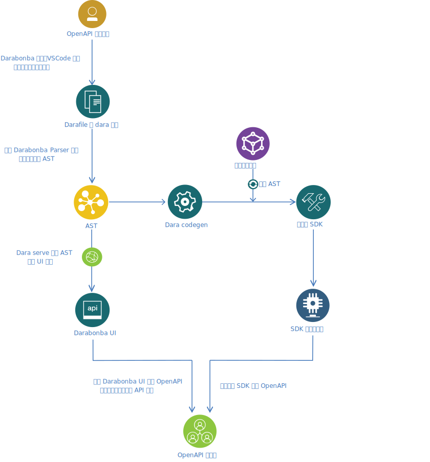

# 5 分钟上手 Darabonba

让我们一起来创建你的第一个 Darabonba 模块。

## Darabonba



## 安装 Darabonba CLI

Darabonba CLI 是由 Node.js 开发的，所以主要由 npm 来安装

```sh
$ npm install -g @darabonba/cli
```

其中包含了以下方法：

```sh
$ dara <command> [<args>]

The CLI for Darabonba 1.0.0

Usage:

    dara <command> [<args>]

Available commands:

start a Darabonba project

    init          initialization package information

working on the Darabonba project
    check         syntax check for tea file
    codegen       generate codes
    clean         clean the libraries folder
    build         build ast file for tea file
    format        format the tea source file
    config        view or update configuration

help commands
    help          print the help information

```

## 构建你的第一个 Darabonba 模块

我们假设要创建一个模块为 hello。首先创建一个目录：

```sh
$ mkdir hello
$ cd hello
```

使用 `dara` 命令初始化模块：

```sh
$ dara init
package scope: mycompany
package name: hello
package version: 1.0.0
main entry: ./hello.dara
```

完成初始化后，会初始化 2 个文件，即包描述文件和入口文件。

```sh
$ ls
Darafile         hello.dara
```

在编辑器中，将下面的代码输入到 `hello.dara` 文件里：

```dara
type @organization = string

// 定义一个 model
model User {
  name: string,
  age: number
}

/**
 * 模块的初始化函数
 * @param organization 
 */
init(organization: string) {
  @organization = organization;
}

/**
 * 模块的静态方法
 * @param username 
 * @param age
 */
static function getUser(username: string, age: number): string {
  var user = new User{
    name = username,
    age = age
  };
  return `user's name is ${user.name} ,user's age is ${user.age}! `;
} 
```

## 生成代码

Darabonba 主要的作用是利用它为任意风格的接口生成多语言的 SDK 、代码示例、测试用例、接口编排等，比如我们生成 TypeScript 的代码就可以直接利用下面的命令编译 `hello.dara` 并将生成的代码输出到同目录下的 tmp 文件夹中：

```sh
$ dara codegen ts ./tmp
```

其他语言输入对应的将 ts 替换为对应的 java、csharp、python、go、php 即可，每个语言都可以配置自己独立的生成配置，具体配置请参考 [Darafile 详解](./darafile.md)。